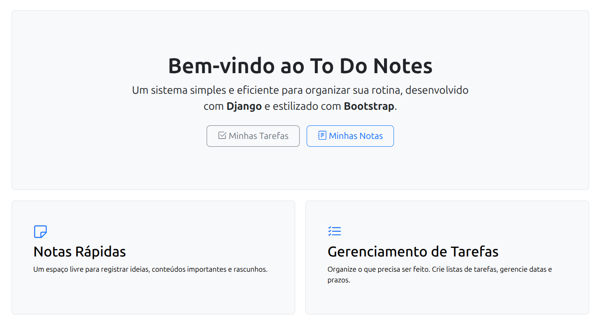

# To Do Notes
Faça listas de tarefas e notas em texto de forma prática, acesse-as de onde você estiver.

# Instruções
1. Cadastre um usuário com suas credenciais
2. Faça login usando usuário e senha
3. Ter tanta coisa na cabeça a ponto de ser necessário anotar para não esquecer

# Especificações
- Criado com Django e Bootstrap
- Sistema hospedado via Render
- Banco de dados via Supabase

[Link para acessar o site](https://to-do-notes.onrender.com/)